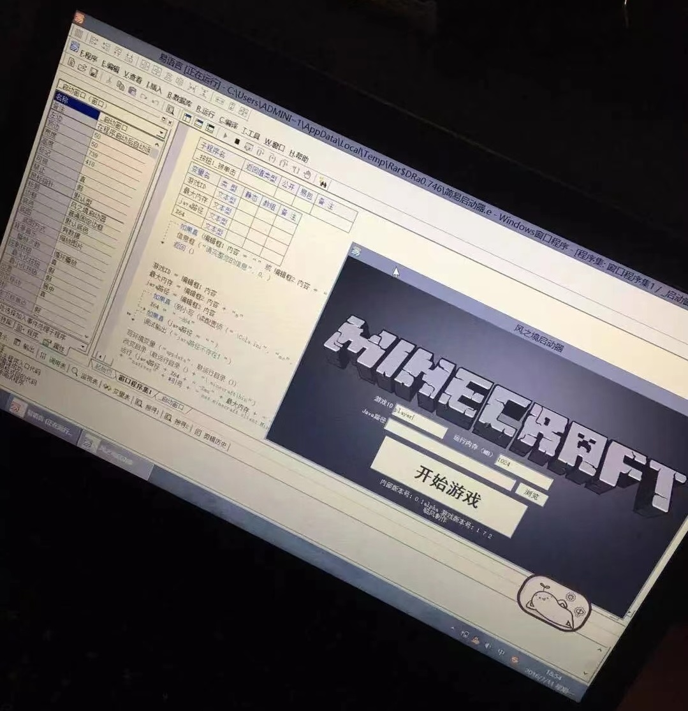
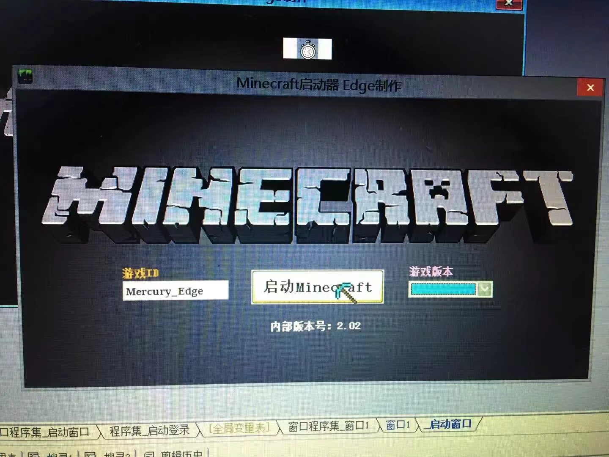
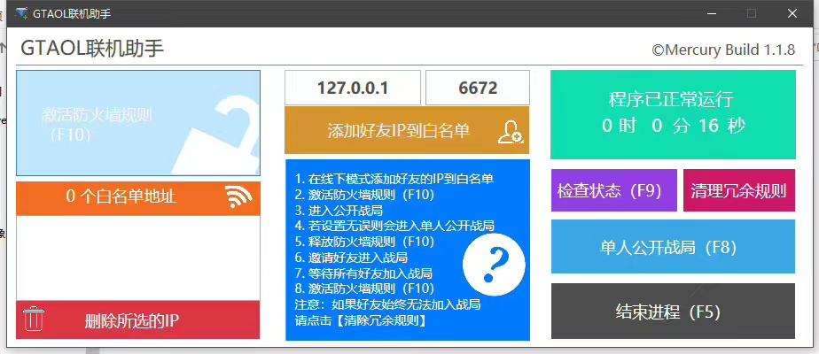
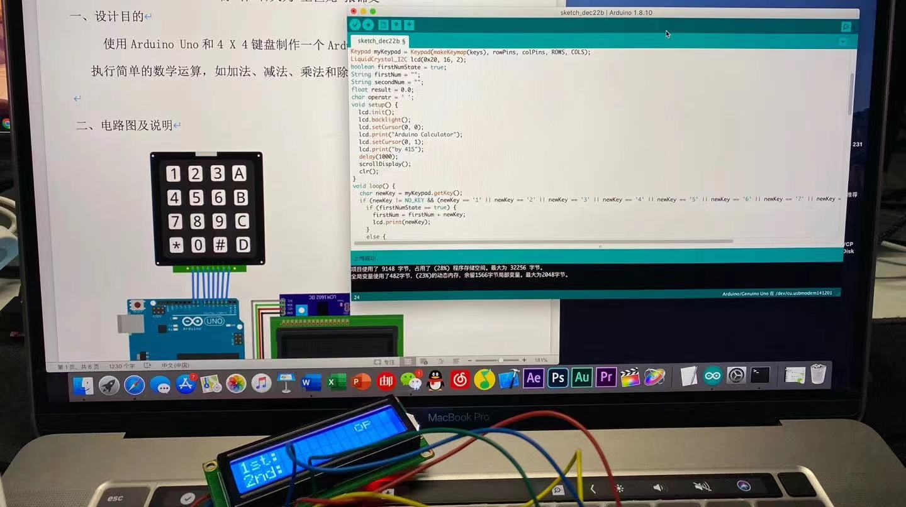
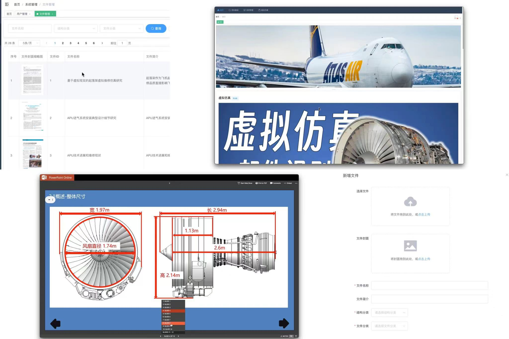

## 关于我

我本人从小学就开始接触电脑，初中开始学习编程、平面设计，高中研究过视频特效制作，大学学的计算机专业。

<div>
<table>
    <tr>
        <!-- <td>
        
            
        </td> -->
        <td>
        <center>
        
        </center>
        </td>
    </tr>
    <tr>
        <td><center>初中用易语言做的MC启动器</center></td>
    </tr>
</table>
</div>

大学早期学过```C#```、```WPF```但都没有入门，后来做了个GTA5联机工具，算是入门了。

<div>
<table>
    <tr>
        <td>
        <center>
        
        </center>
        </td>
    </tr>
    <tr>
        <td><center>大二遭遇疫情，当时正值GTA5免费时期，于是和朋友们一起联机</center></td>
    </tr>
    <tr>
        <td><center>为了防止外挂玩家打扰我们，专门做了个IP白名单工具</center></td>
    </tr>
        <tr>
        <td><center>原理就是修改系统防火墙的入站出站规则，指定好友的IP加入游戏房间</center></td>
    </tr>
</table>
</div>

大学时期使用```Arduino```做过一个计算器，用```WordPress```做博客，用```C#```写APP，折腾过```群辉NAS```，```云服务器```。

<div>
<table>
    <tr>
        <td>
        <center>
        
        </center>
        </td>
    </tr>
    <tr>
        <td><center>Arduino课程设计做的计算器，还用Keynotes做了个特别炫酷的PPT</center></td>
    </tr>
</table>
</div>

毕业时用```Springboot```和```Vue```与舍友和民航大学的老师做了个虚拟仿真教学系统，拿了优秀毕设。

<div>
<table>
    <tr>
        <td>
        <center>
        
        </center>
        </td>
    </tr>
    <tr>
        <td><center>系统主要功能的截图</center></td>
    </tr>
</table>
</div>

[项目在线演示](https://mercuryedge.github.io/aircraft-main/) [项目Github链接](https://github.com/MercuryEdge/aircraft-main)

> 演示账号：demo 密码：123456

毕业后的第一份工作在理想汽车做数据开发，用```SQL```、```Python```和```Hadoop```做数据中台。

<div>
<table>
        <td>
        <center>
        
        </center>
        </td>
    <tr>
        <td><center>入职前一天拍的公司门口，现在已经搬到二期新公区了</center></td>
    </tr>
</table>
</div>

技术栈只是工具，不要让编程语言限制了你的发展。

专业上，我目前熟悉```Web开发```、```数据开发```、```计算机网络```这三个方向。

未来我想了解学习```游戏开发```、```计算机视觉```及```自然语言处理```等人工智能方向。

## 联系我
::: tip
Email：mercuryedge@outlook.com
:::
## 关于本站
::: tip
基于[vuepress](https://v1.vuepress.vuejs.org/zh/)生成，主题采用[vuepress-theme-reco-v1](http://v1.vuepress-reco.recoluan.com/)，网站托管于[Github](https://github.com/)。
:::