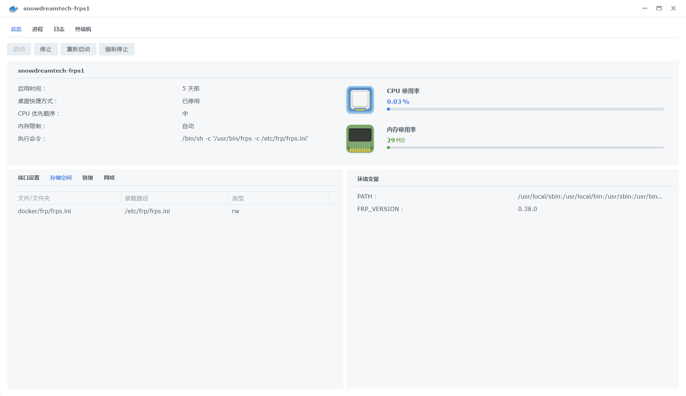

::: tip
[Docker容器地址](https://registry.hub.docker.com/r/snowdreamtech/frps/)

客户端/服务端备份：

     /volume1/Review/frp_0.20.0_windows_amd64.rar
     
:::

## 配置文件


### 服务端
```
// frps.ini
[common]
bind_port = 5443
kcp_bind_port = 5443
dashboard_port = 6443
dashboard_user = username //用户名
dashboard_pwd = password //密码
vhost_http_port = 2000
vhost_https_port = 2443
log_file = ./frps.log
log_level = info
log_max_days = 3
token = OAuthToken //链接Token
max_pool_count = 200
tcp_mux = true
```

### 客户端
```
// frpc.ini
[common]
server_addr = {服务器地址}
server_port = 5443
token = OAuthToken //链接Token

// 新的端口开放格式：

[服务名称]
type = [tcp/udp]
remote_port = [外部端口号]
local_port = [内部端口号]
```

